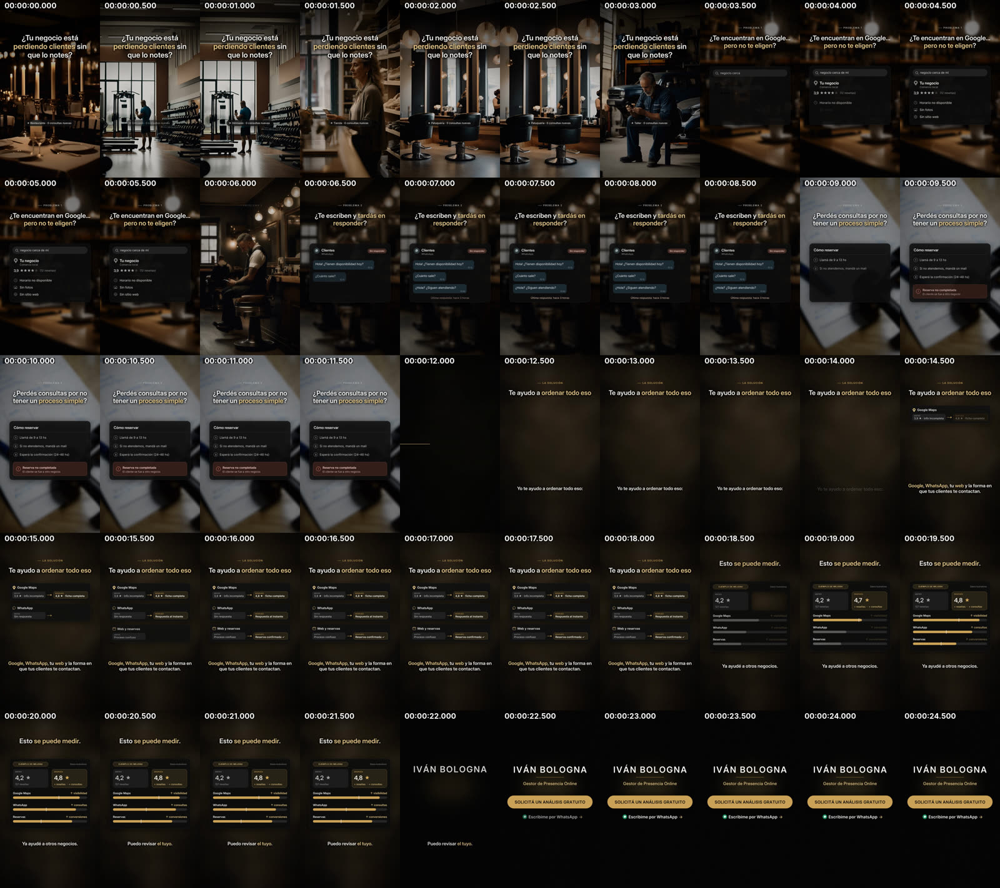

# Análisis del video de referencia

**Archivo analizado:** `video-publicitario/video-final-v2.mp4` (rama `claude/ivan-bologna-ad-video-opjxs0`).
Es el único video que existe en el repositorio, así que lo uso como referencia. Funciona como
**"punto de partida a superar"**: tiene buenas decisiones de texto e interfaz, pero se apoya en
fotografías de rubros (restaurante, gimnasio, peluquería, taller), que es justo lo que la nueva
dirección prohíbe.

Se analizó también la v1 (`video-final.mp4`, 16 s) solo a nivel metadatos.

Herramienta reutilizable: `bash analysis/analyze.sh <video> <carpeta>` (ffprobe, frames cada
0,5 s, hoja de contactos, cortes, loudness y onsets).

---

## 1. Metadatos (ffprobe)

| Campo | v2 (referencia) | v1 |
|---|---|---|
| Duración | 24,9 s | 16,0 s |
| Video | H.264 High, 1080×1920, 30 fps, yuv420p | H.264, 1080×1920, 30 fps |
| Bitrate video | 8,95 Mb/s | 9,14 Mb/s |
| Frames | 747 | — |
| Audio | AAC LC, 48 kHz, estéreo, 197 kb/s | AAC, 48 kHz, 194 kb/s |
| Loudness integrado | **−14,2 LUFS** (LRA 3,4 LU) | — |
| True peak | −1,4 dBFS | — |

Salidas completas: `reference/ffprobe-v2.txt`, `reference/ffprobe-v1.txt`.

## 2. Capturas

- Hoja de contactos completa (cada 0,5 s): `reference/contact-sheet.jpg`
- 50 frames individuales: `reference/frames/t000.0.jpg` … `t024.5.jpg`
- Frames completos: `reference/full_045.jpg` (problema), `reference/full_155.jpg` (solución), `reference/full_23.jpg` (cierre)

## 3. Estructura y timing

Cortes de escena detectados: 0,7 · 1,4 · 2,1 · 2,8 · 3,5 · 6,2 · 8,8 · 12,2 s.

| Tramo | Tiempo | Contenido | Observación |
|---|---|---|---|
| Gancho | 0–3,5 s | "¿Tu negocio está perdiendo clientes sin que lo notes?" sobre 5 fotos de rubros cortadas cada 0,7 s | El texto queda fijo 3,5 s mientras el fondo cambia: el ojo persigue la foto, no la frase. |
| Problema 1 | 3,5–6 s | Ficha de Maps estilizada (3,9 ★, sin horario, sin fotos) | Buena idea: interfaz construida, no screenshot. Tarjeta chica (≈ 55 % del ancho útil) y con texto de 22–26 px: ilegible en celular. |
| Problema 2 | 6–9 s | Chat de WhatsApp "Sin responder" | Mismo problema de escala. Fondo foto desenfocada compite con la UI. |
| Problema 3 | 9–12 s | "Cómo reservar" con alerta roja | La alerta roja es el único momento de color distinto: funciona. |
| Transición | 12,0–12,3 s | Corte a negro + línea dorada | Único gesto de transición del video. |
| Solución | 12,3–18,5 s | "Te ayudo a ordenar todo eso" + antes/después por canal | Lo más claro del video. Pero hay una **zona vacía de ≈ 350 px** entre las tarjetas y el texto inferior (ver `full_155.jpg`). |
| Prueba | 18,5–22 s | "Esto se puede medir" con barras | Datos ilustrativos; barras y números chicos. |
| Cierre | 22–24,9 s | Nombre + rol + botón dorado + "Escribime por WhatsApp" | Correcto y legible; muy estático. |

**Ritmo narrativo:** ~6 bloques en 25 s (≈ 4 s por idea). Lo correcto para Reels es 1 idea cada
2–3 s con un cambio visual cada ~1 s. La referencia tiene tramos de 3–6 s sin cambio relevante
(9–12 s, 18,5–22 s): ahí es donde se pierde retención.

## 4. Composición y jerarquía

- **Titular** arriba (y ≈ 380–450 px), 64–72 px, una palabra clave en dorado. Bien.
- **Eyebrow** ("— LA SOLUCIÓN") 26 px con tracking amplio. Buena jerarquía de tres niveles.
- **Tarjetas UI** centradas pero chicas; textos internos 26–34 px. En un celular de 6" eso es ≈ 9–12 pt.
- **Texto inferior** (y ≈ 1400–1480) cae dentro de la zona que tapan los controles de Reels/TikTok.
- Composición siempre **plana y frontal**: ninguna capa en profundidad, ningún movimiento de cámara
  sobre la UI. Se siente como diapositivas.
- Márgenes laterales ≈ 90–100 px: correctos.

## 5. Tipografía

- Inter / SF Pro, Semibold para titulares, Medium para cuerpo. Tracking ligeramente negativo.
- Dorado `#C9A45C` como único acento. Blanco hueso para el resto.
- Correcto y sobrio, pero **la escala es tímida**: el titular más grande ocupa ~80 % del ancho
  a 64 px. Para Reels conviene que la palabra principal de cada escena sea enorme (140–220 px).

## 6. Animación y transiciones

- Entradas: fade + subida de ~12 px. Sin blur, sin profundidad, sin spring.
- La mayoría de los cambios son **cortes duros** de foto a foto.
- Una sola transición diseñada (línea dorada a los 12 s).
- No hay tipografía cinética: las frases aparecen completas, no palabra por palabra.

## 7. Audio

- −14,2 LUFS integrado y LRA 3,4 LU: muy comprimido, nivel correcto para redes.
- Onsets detectados cada ~0,3–0,5 s en el gancho (acompañan los cortes de foto) y luego cada
  ~0,5–1 s (clics de UI y voz).
- Tiene locución (TTS). Sin voz, el video se sostiene a medias: el texto en pantalla es chico.

## 8. Conclusiones → decisiones para la fábrica

| Problema en la referencia | Decisión en el sistema nuevo |
|---|---|
| Depende de fotos de rubros | **Cero fotos.** Fondos diseñados (gradiente, luz volumétrica, anillos, grano, partículas). |
| Composición plana | **Cámara virtual 3D** por escena (dolly, parallax por profundidad `z`, tilt). |
| Frases que aparecen completas | **TextReveal** palabra por palabra con blur + opacidad + translateY. |
| Texto chico en UI | Tipografía mínima validada por QA (≥ 34 px efectivos), palabras clave de 140–220 px. |
| Zonas vacías y texto en zona de controles | **snap.js** detecta zonas vacías, textos fuera de la zona segura (y 200–1560) y superposiciones, y corrige solo. |
| Tramos de 4–6 s sin cambio | Escenas de 1,7–5 s, con un evento visual + sonoro cada ~0,5–1 s (cues). |
| Una sola transición | **SceneTransition** (blur, zoom, push) entre todas las escenas, con whoosh. |
| Paleta fija negro/dorado | **Temas intercambiables** (midnight, ivory, emerald, ocean, violet, gold, aurora) desde `COLORS`. |
| Audio dependiente de TTS | **Audio procedural** sincronizado a los eventos visuales (cues), sin samples. |

Lo que se conserva de la referencia: interfaces construidas a mano (Maps, WhatsApp), eyebrows con
tracking, un solo color de acento por escena, cierre con botón tipo pastilla y loudness ≈ −14 LUFS.
