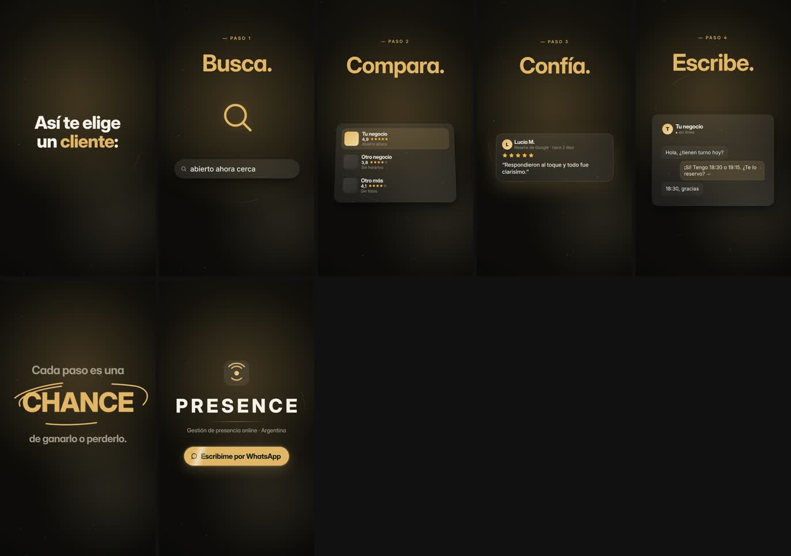

# QA · como-te-eligen

Estado: **APROBADO** · iteraciones: 1 · duración 26.50 s · 7 escenas

Con zona segura y cajas de layout: `contact-overlay.jpg` (capturas individuales en `overlay/`)

| # | Escena | Inicio | Dur. | Reposo | Errores | Advertencias |
|---|---|---|---|---|---|---|
| 1 | gancho | 0.00 | 2.60 | 0.90 | — | — |
| 2 | paso1 | 2.60 | 3.60 | 4.99 | — | — |
| 3 | paso2 | 6.20 | 3.80 | 7.58 | — | — |
| 4 | paso3 | 10.00 | 3.80 | 11.38 | — | — |
| 5 | paso4 | 13.80 | 4.40 | 16.65 | — | — |
| 6 | remate | 18.20 | 3.80 | 20.43 | — | — |
| 7 | cierre | 22.00 | 4.50 | 24.15 | — | — |

## Correcciones automáticas aplicadas

Ninguna: el layout pasó a la primera.

## Reglas

- Zona segura de texto: x 80–1000, y 200–1560 (fuera quedan los controles de Reels/TikTok).
- Tamaño mínimo efectivo: 34 px titulares y cuerpo, 26 px etiquetas y UI.
- Sin superposición entre bloques de texto visibles (opacidad > 0,6).
- Zona vacía: advertencia si hay más de 420 px verticales sin contenido.
- Jerarquía: advertencia si el texto principal no es al menos 1,15× el segundo.
