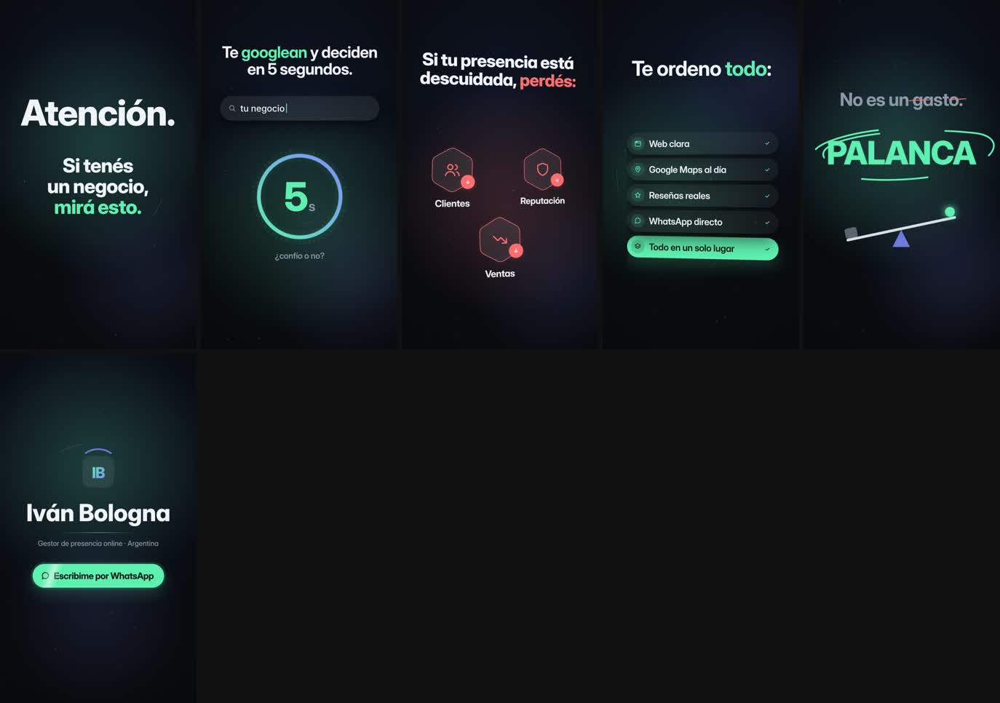

# QA · presencia

Estado: **APROBADO** · iteraciones: 1 · duración 19.46 s · 6 escenas

Con zona segura y cajas de layout: `contact-overlay.jpg` (capturas individuales en `overlay/`)

| # | Escena | Inicio | Dur. | Reposo | Errores | Advertencias |
|---|---|---|---|---|---|---|
| 1 | gancho | 0.00 | 2.23 | 1.40 | — | — |
| 2 | cinco | 2.23 | 3.32 | 5.13 | — | — |
| 3 | perdes | 5.55 | 4.00 | 8.65 | — | — |
| 4 | ordeno | 9.55 | 3.36 | 12.03 | — | — |
| 5 | palanca | 12.91 | 2.50 | 15.01 | — | — |
| 6 | cierre | 15.41 | 4.05 | 17.41 | — | — |

## Correcciones automáticas aplicadas

Ninguna: el layout pasó a la primera.

## Reglas

- Zona segura de texto: x 80–1000, y 200–1560 (fuera quedan los controles de Reels/TikTok).
- Tamaño mínimo efectivo: 34 px titulares y cuerpo, 26 px etiquetas y UI.
- Sin superposición entre bloques de texto visibles (opacidad > 0,6).
- Zona vacía: advertencia si hay más de 420 px verticales sin contenido.
- Jerarquía: advertencia si el texto principal no es al menos 1,15× el segundo.
