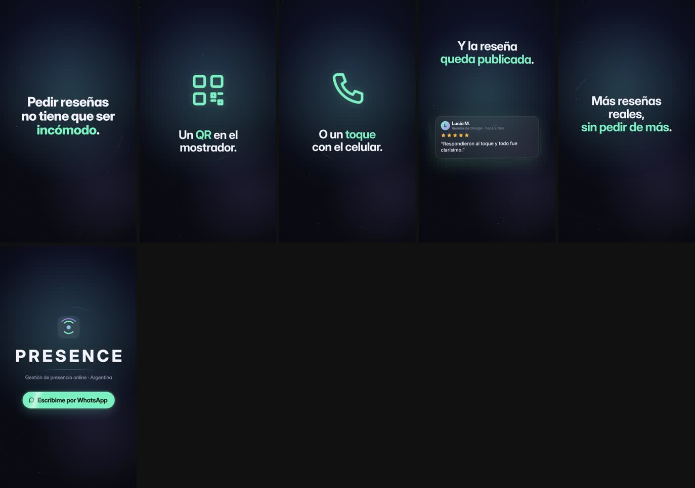

# QA · qr-nfc-resenas

Estado: **APROBADO** · iteraciones: 1 · duración 22.00 s · 6 escenas

Con zona segura y cajas de layout: `contact-overlay.jpg` (capturas individuales en `overlay/`)

| # | Escena | Inicio | Dur. | Reposo | Errores | Advertencias |
|---|---|---|---|---|---|---|
| 1 | gancho | 0.00 | 2.80 | 1.05 | — | — |
| 2 | qr | 2.80 | 3.60 | 4.20 | — | — |
| 3 | nfc | 6.40 | 3.60 | 7.88 | — | — |
| 4 | resena | 10.00 | 4.00 | 11.58 | — | — |
| 5 | remate | 14.00 | 3.40 | 15.05 | — | — |
| 6 | cierre | 17.40 | 4.60 | 19.55 | — | — |

## Correcciones automáticas aplicadas

Ninguna: el layout pasó a la primera.

## Reglas

- Zona segura de texto: x 80–1000, y 200–1560 (fuera quedan los controles de Reels/TikTok).
- Tamaño mínimo efectivo: 34 px titulares y cuerpo, 26 px etiquetas y UI.
- Sin superposición entre bloques de texto visibles (opacidad > 0,6).
- Zona vacía: advertencia si hay más de 420 px verticales sin contenido.
- Jerarquía: advertencia si el texto principal no es al menos 1,15× el segundo.
