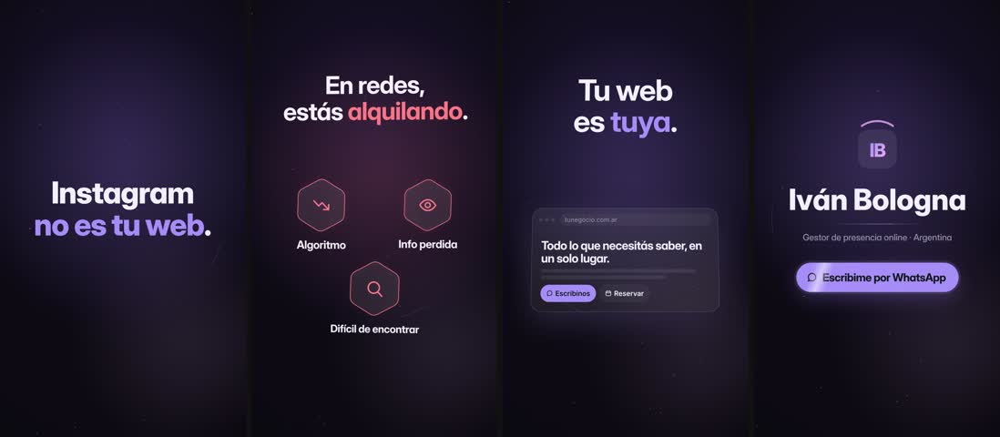

# QA · redes-vs-web

Estado: **APROBADO** · iteraciones: 1 · duración 15.30 s · 4 escenas

Con zona segura y cajas de layout: `contact-overlay.jpg` (capturas individuales en `overlay/`)

| # | Escena | Inicio | Dur. | Reposo | Errores | Advertencias |
|---|---|---|---|---|---|---|
| 1 | gancho | 0.00 | 2.42 | 0.90 | — | — |
| 2 | redes | 2.42 | 4.24 | 4.22 | — | — |
| 3 | web | 6.66 | 3.54 | 7.96 | — | — |
| 4 | cierre | 10.20 | 5.10 | 12.20 | — | — |

## Correcciones automáticas aplicadas

Ninguna: el layout pasó a la primera.

## Reglas

- Zona segura de texto: x 80–1000, y 200–1560 (fuera quedan los controles de Reels/TikTok).
- Tamaño mínimo efectivo: 34 px titulares y cuerpo, 26 px etiquetas y UI.
- Sin superposición entre bloques de texto visibles (opacidad > 0,6).
- Zona vacía: advertencia si hay más de 420 px verticales sin contenido.
- Jerarquía: advertencia si el texto principal no es al menos 1,15× el segundo.
