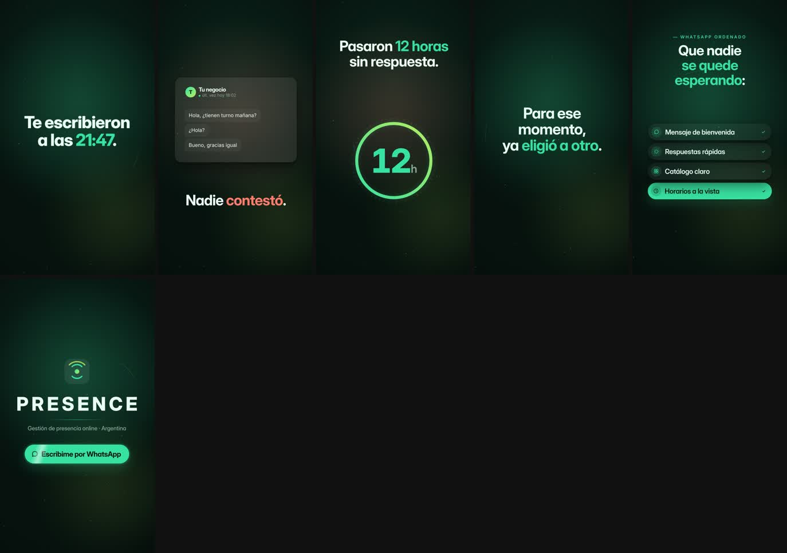

# QA · whatsapp-no-responde

Estado: **APROBADO** · iteraciones: 1 · duración 24.50 s · 6 escenas

Con zona segura y cajas de layout: `contact-overlay.jpg` (capturas individuales en `overlay/`)

| # | Escena | Inicio | Dur. | Reposo | Errores | Advertencias |
|---|---|---|---|---|---|---|
| 1 | gancho | 0.00 | 2.60 | 0.90 | — | — |
| 2 | chat | 2.60 | 4.40 | 5.48 | — | — |
| 3 | horas | 7.00 | 4.60 | 11.20 | — | — |
| 4 | otro | 11.60 | 3.20 | 12.65 | — | — |
| 5 | solucion | 14.80 | 5.20 | 17.76 | — | — |
| 6 | cierre | 20.00 | 4.50 | 22.15 | — | — |

## Correcciones automáticas aplicadas

- `solucion/0` → {"y":-711} (superposicion)
- `solucion/1` → {"y":-509} (superposicion)

## Reglas

- Zona segura de texto: x 80–1000, y 200–1560 (fuera quedan los controles de Reels/TikTok).
- Tamaño mínimo efectivo: 34 px titulares y cuerpo, 26 px etiquetas y UI.
- Sin superposición entre bloques de texto visibles (opacidad > 0,6).
- Zona vacía: advertencia si hay más de 420 px verticales sin contenido.
- Jerarquía: advertencia si el texto principal no es al menos 1,15× el segundo.
